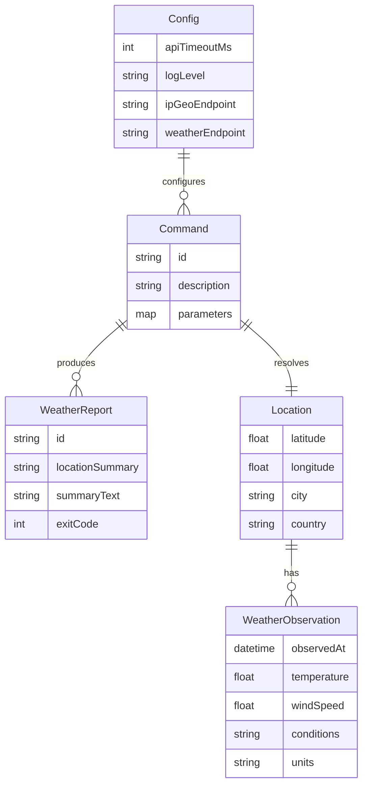

# Domain Model for Archetype Java CLI

## Overview

Archetype Java CLI operates in the developer tooling domain, providing a starter template for Java command‑line applications. It manages CLI commands, configuration, and a sample business feature for fetching current weather, showcasing integration with external APIs.

## Main Entities

### E1 Command

Description: Represents a CLI command available to the user via Spring Shell (e.g., `weather`).

Attributes:

- id: string – Command name (unique identifier).
- description: string – Short help text for the command.
- parameters: map<string, string> – Optional key/value parameters provided by the user.

### E2 Location

Description: A coarse geolocation used to request weather data.

Attributes:

- latitude: number – Decimal degrees in [-90, 90].
- longitude: number – Decimal degrees in [-180, 180].
- city: string – Optional city/town name.
- country: string – Optional country name/code.

### E3 WeatherObservation

Description: The current weather snapshot returned by the weather service.

Attributes:

- observedAt: datetime – Timestamp of the observation.
- temperature: number – Air temperature at 2m.
- windSpeed: number – Wind speed.
- conditions: string – Short textual summary (e.g., “Clear”).
- units: string – Units descriptor (e.g., "C", "F", "m/s").

### E4 WeatherReport

Description: A human‑readable summary produced by the `weather` command for terminal output.

Attributes:

- id: string – Derived identifier (e.g., command invocation id).
- locationSummary: string – Compact description of the location.
- summaryText: string – Final text line(s) printed to the user.
- exitCode: number – 0 on success; non‑zero on errors.

### E5 Config

Description: Runtime configuration sourced from environment variables with sensible defaults.

Attributes:

- apiTimeoutMs: number – HTTP client timeout in milliseconds.
- logLevel: string – Logging level (e.g., INFO, DEBUG).
- ipGeoEndpoint: string – Base URL for IP Geolocation API.
- weatherEndpoint: string – Base URL for weather API (Open‑Meteo).

## Entity Relationships

### R1 Command → WeatherReport

Relationship Type: One‑to‑Many
Description: Each command invocation produces one WeatherReport; a command can be executed many times.
Business Rule: Command execution must return a clear result and exit code.

### R2 Command → Location

Relationship Type: One‑to‑One
Description: For the `weather` command, a Location is resolved (via IP Geolocation or provided parameters) for the invocation.
Business Rule: If geolocation fails, the command returns a graceful error report.

### R3 Location → WeatherObservation

Relationship Type: One‑to‑Many
Description: A location can have many observations over time; the command fetches the “current” snapshot.
Business Rule: Only the latest/current observation is required for the report.

### R4 Config → Command

Relationship Type: One‑to‑Many
Description: Config parameters apply to all commands and their outbound requests.
Business Rule: Default values must be used when environment variables are absent.

## Business Rules and Validations

### Data Validation

- Latitude must be within −90 to +90; longitude within −180 to +180.
- apiTimeoutMs must be positive; if unset, default is applied.
- When present, city/country names are non‑empty strings.

### Business Operation Rules

- The `weather` command must attempt IP geolocation when explicit coordinates are not provided.
- On network errors or upstream failures, produce a clear, user‑friendly error message and non‑zero exit code.
- No secrets or PII are persisted; only outbound HTTPS calls to public APIs are performed.

## Entity‑Relationship Diagram

## Additional Information

- Git repository: https://github.com/AIDDbot/ArchetypeJavaCLI
- [PRD Document](./PRD.md)
- [SYSTEMS Architecture](./SYSTEMS.md)
- [BACKLOG of features](./BACKLOG.md)

> End of DOMAIN for Archetype Java CLI, last updated on 2025-08-27.
