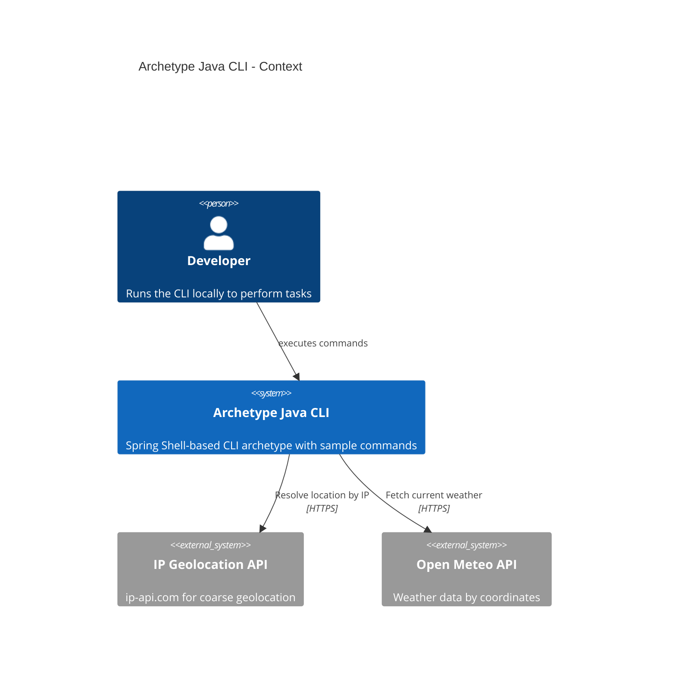

# Project Requirements Document for Archetype Java CLI

## Overview

**Archetype Java CLI** aims to provide a simple, opinionated starter for building Java command-line interfaces using Spring Boot and Spring Shell. It includes a sample weather command, sensible tooling defaults, and documentation to accelerate learning and bootstrapping new CLI projects.

### Goals 

- Deliver a ready-to-run CLI skeleton with Spring Shell, configuration via environment variables, and structured logging.
- Showcase a sample business feature (Weather command) integrating with public APIs.
- Serve as a teaching/reference template with tests and docs to guide new projects.

## Requirements

### R1 CLI scaffold and runtime

Provide a Spring Boot + Spring Shell CLI application that starts locally, exposes a help system, and supports commands safely.

### R2 Weather command (sample feature)

Offer a `weather` command that resolves approximate latitude/longitude via IP and fetches current weather data from Open Meteo, then prints concise output.

### R3 Configuration via environment variables

Allow configuration for things like timeouts, log level, and API endpoints via environment variables with sensible defaults.

### R4 Monitoring and logging

Provide structured logging with log levels suitable for local dev and troubleshooting; include minimal operational metrics where appropriate.

### R5 Testing

Include unit tests for core utilities and the sample feature, plus an end-to-end (E2E) smoke test that executes the CLI command.

### R6 Documentation

Document installation, running, configuration, and the sample command usage. Include references to external services used.

## Technical Constraints

- Java 21 runtime and language level.
- Spring Boot with Spring Shell for CLI commands.
- Maven (3.9.x) for build and dependency management.
- No database or persistence; stateless local execution.
- Outbound HTTPS required for sample feature (IP Geolocation API and Open Meteo).

### System C4 Context diagram

## Additional Information

- Git repository: https://github.com/AIDDbot/ArchetypeJavaCLI
- [DOMAIN Models](./DOMAIN.md)
- [SYSTEMS Architecture](./SYSTEMS.md)
- [BACKLOG of features](./BACKLOG.md)

> End of PRD for Archetype Java CLI, last updated on 2025-08-27.
