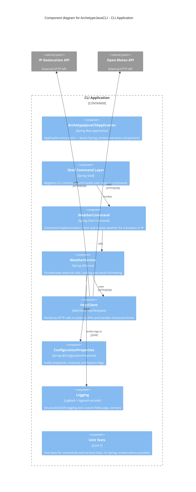

# Structure for ArchetypeJavaCLI

## Overview

ArchetypeJavaCLI is a Spring Boot-based Java command-line application scaffold that demonstrates how to build CLI apps with Spring Shell, structured logging, and a small sample command (weather). The repository provides documentation, tests, and a reproducible Maven build.

## Bill of Materials

- Language: Java 21
- Framework: Spring Boot
- CLI tooling: Spring Shell
- Build tool: Maven
- Testing: JUnit 5, Maven Surefire
- Logging: Logback with logstash encoder

### Development / Deployment workflow

- Development:
  - Use Java 21 and Maven 3.9+.
  - Run tests locally with `mvn test` or `mvn -Dtest=*UnitTest test` for unit-only.
  - Use `mvn -q spring-boot:run` to start the CLI in development with hot reload of code after rebuilds.

- Packaging/Release:
  - Build a distributable JAR with `mvn -DskipTests package`.
  - Ship the resulting `target/archetype-java-cli-0.1.0-SNAPSHOT.jar`.

- CI/CD:
  - Typical pipeline: `mvn -B -DskipTests clean package` followed by running tests and publishing artifacts.

## Folder Structure

Top-level layout (important folders and files):

- `src/main/java/` - Application source code.
- `src/main/resources/` - Application resources (configuration, banner, logging config).
- `src/test/java/` - Test sources.
- `src/test/resources/` - Test resources and test-specific config.
- `docs/` - Project documentation (PRD, DOMAIN, SYSTEMS, BACKLOG, MANUAL, STRUCTURE).
- `target/` - Build output (generated by Maven).
- `logs/` - Example runtime logs (not committed in normal flows).

### Key files

- `pom.xml`: Maven build configuration and dependencies.
- `src/main/resources/application.properties`: Default Spring properties used at runtime.
- `src/main/resources/logback-spring.xml`: Logging configuration (structured JSON output).
- `docs/STRUCTURE.md`: This file, describing how the project is organized.
- `README.md`: Top-level project description and quick start.

## Components diagram

> End of STRUCTURE for ArchetypeJavaCLI, last updated on 2025-09-02.
