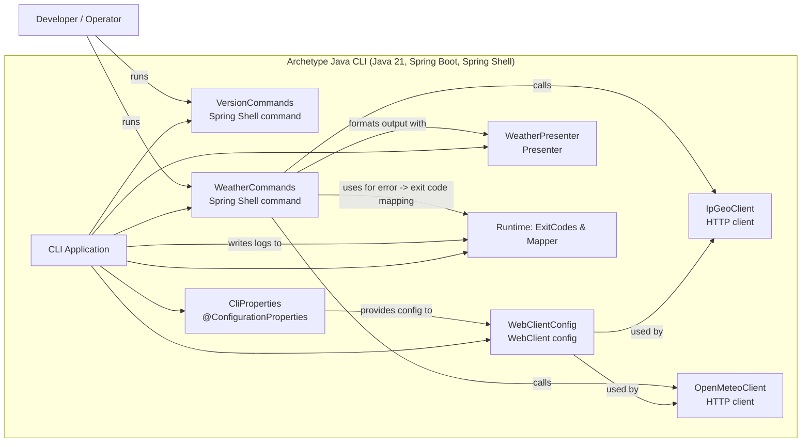

## Structure for Archetype Java CLI

### Overview

Archetype Java CLI is a small, opinionated Spring Boot CLI application that exposes developer-friendly commands via Spring Shell. It provides:

- a `version` command to print build and runtime metadata
- a sample `weather` flow (IP geolocation -> Open‑Meteo -> presenter)
- strongly-typed configuration via `@ConfigurationProperties`
- structured JSON logging (Logback configuration)
- fast unit tests (Surefire) and a clear separation between unit/IT testing

The project is organized by feature (screaming architecture) to make intent and ownership clear.

Last updated: 2025-09-01

### Folder overview

Top-level layout (concise):

```
src/
  main/
    java/com/aiddbot/archetype/cli/
      ArchetypeJavaCliApplication.java    # Spring Boot non-web entrypoint
      commands/                           # Spring Shell commands (version, weather...)
      config/                             # @ConfigurationProperties, client wiring
      integrations/                       # External API clients and DTOs
      presenter/                          # Human-friendly presenters
      runtime/                            # Exit codes, coded exceptions, mappers
    resources/                            # application.properties, logging, banner
  test/                                   # Unit tests mirroring main structure
```

Key feature modules (high-level):

- commands: `VersionCommands`, `WeatherCommands` — shell entrypoints and orchestration
- config: `CliProperties`, `WebClientConfig` — configuration and HTTP client setup
- integrations/ipapi: IP → coordinates client and DTOs (F3.1)
- integrations/openmeteo: Open‑Meteo client and mapping (F3.2)
- presenter: `WeatherPresenter` — formatting human-readable output (F3.3)
- runtime: `ExitCodes`, `CodedException`, `DefaultExitCodeExceptionMapper` — standardize exit behavior (F3.4)

### Key files

- `src/main/java/com/aiddbot/archetype/cli/ArchetypeJavaCliApplication.java` — Spring Boot CLI entrypoint
- `src/main/java/com/aiddbot/archetype/cli/commands/VersionCommands.java` — prints build version and metadata
- `src/main/java/com/aiddbot/archetype/cli/commands/WeatherCommands.java` — orchestrates the example Weather flow
- `src/main/java/com/aiddbot/archetype/cli/config/CliProperties.java` — typed configuration and validation
- `src/main/java/com/aiddbot/archetype/cli/runtime/*` — exit codes and coded exceptions
- `src/main/java/com/aiddbot/archetype/cli/integrations/*` — external API clients and DTOs

### Bill of Materials

- Language: Java 21
- Frameworks & libraries: Spring Boot 3.5.x, Spring Shell, Spring Web (WebClient), Logback
- Formatting: Spotless (Google Java Format)
- Testing: JUnit 5, Mockito, Spring Boot Test
- Build: Maven (maven-compiler-plugin, enforcer, spring-boot-maven-plugin)

### Build & packaging notes

- Java 21 is enforced via Maven Enforcer and compiler plugin (:--release=21:).
- Unit tests run under Surefire; integration tests are separated for Failsafe.
- The Spring Boot Maven Plugin produces an executable fat JAR and generates `build-info`.
- Resources: `application.properties` is filtered; other resources are not.

### Conventions and guidance

- Feature-first layout: keep code grouped by feature to make the intent explicit.
- Public behavior should be covered by fast unit tests; external integrations have client-level unit tests and can be covered by integration tests behind the Failsafe profile.
- Use `CodedException` and `ExitCodes` to ensure consistent process exit codes when commands fail.

## Minimal "how to contribute"

1. Create a feature branch: `feat/<id>` (use backlog IDs like `f3.1` when available).
2. Implement feature with unit tests under `src/test/java/...`.
3. Run `mvn -DskipITs=true test` locally and keep build green.
4. Open a PR referencing the backlog item.

> End of STRUCTURE for Archetype Java CLI

## Component diagram (Mermaid)

The diagram below is a component-level view of the CLI application rendered with Mermaid. It shows commands, configuration, HTTP clients and the presenter.



This component view maps directly to the `src/main/java/com/aiddbot/archetype/cli/*` packages described above.

> End of STRUCTURE for Archetype Java CLI, last updated on 2025-09-01.