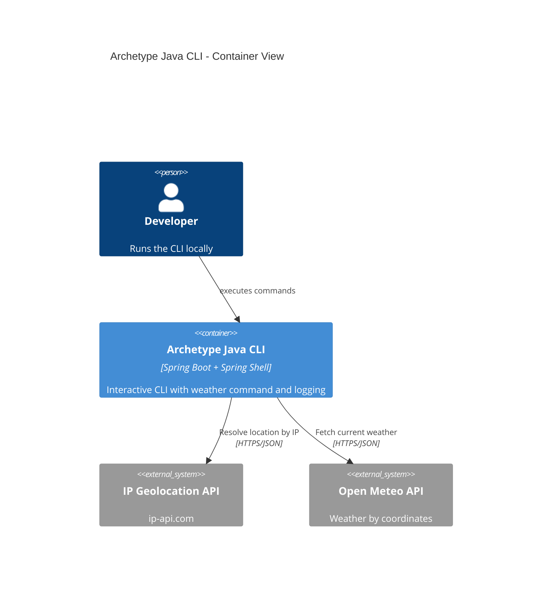

# Systems Architecture for Archetype Java CLI

Follows the glossary of terms and concepts from [AIDDbot Glossary](../.github/instructions/std_aidd-glossary.instructions.md)

## Overview

Archetype Java CLI follows a single-container, layered architecture designed for portability and simplicity, using Spring Boot with Spring Shell for an interactive CLI and minimal outbound HTTP integrations.

## Presentation Tier

### A1 Archetype Java CLI (Spring Shell)

**Purpose:** Provide an interactive command-line interface with help, command parsing, and output formatting. Hosts the sample Weather command and structured logging.

**Technology Stack:**

- Language: java (21)
- Framework: spring-shell on spring-boot
- Key Libraries: Spring Shell, Spring Boot, Spring WebClient (reactive HTTP client), Jackson (JSON)
- Other Packages: Maven 3.9.x build plugins (Surefire, Failsafe), SLF4J-compatible logging

**Responsibilities:**

- Expose CLI commands with help and parameter parsing
- Read configuration from environment variables and defaults
- Call external HTTP APIs and transform results
- Produce human-readable and structured logs
- Exit with clear status codes and messages

## Application Tier

### A2 — Not applicable (single application)

**Purpose:** N/A in this project; all logic resides within the single CLI application.

**Technology Stack:** N/A

**Responsibilities:** N/A

## Data Tier

### D1 — None (no database)

**Database Type:** None
**Technology:** N/A

**Responsibilities:**

- No persistence; the CLI is stateless and ephemeral per invocation

## Integration Patterns

### I1 Weather Data (Open‑Meteo)

**Type:** REST API
**Purpose:** Fetch current weather data for a given latitude/longitude
**Protocol:** HTTPS
**Data Format:** JSON

### I2 IP Geolocation (ip-api.com)

**Type:** REST API
**Purpose:** Resolve coarse location (lat/lon) from the caller’s public IP when not provided
**Protocol:** HTTPS
**Data Format:** JSON

## Security Architecture

### Authentication & Authorization

**Authentication Method:** None for local CLI usage; outbound calls to public APIs require no authentication
**Session Management:** Not applicable (short-lived process per invocation)
**Authorization Pattern:** Not applicable; no user identity or role model in scope

### Data Protection

- Avoid logging PII; only coarse geolocation used and not persisted
- Honor environment-driven configuration (timeouts, endpoints)
- Use HTTPS for all outbound requests

## Systems Architecture Diagram

## Additional Information

- [Git repository](https://github.com/AIDDbot/ArchetypeJavaCLI)
- [PRD Document](./PRD.md)
- [DOMAIN Models](./DOMAIN.md)
- [BACKLOG of features](./BACKLOG.md)

> End of SYSTEMS for Archetype Java CLI, last updated on 2025-08-27.
