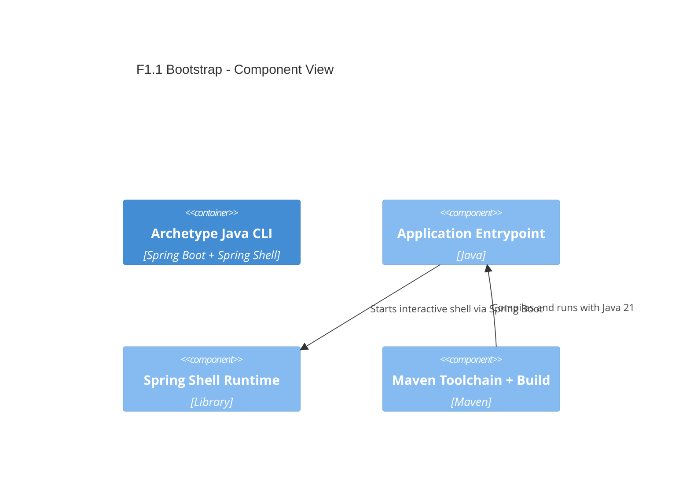

# F1.1 Project bootstrap (Maven + Spring Boot + Spring Shell) Design 

## Overview

Bootstrap a Java 21 Maven project using Spring Boot and Spring Shell to provide an interactive CLI skeleton. The outcome is a runnable application that opens a Spring Shell prompt with no custom commands yet, enforces Java 21 via Maven Toolchains, and exposes basic app metadata (name and version) in configuration and logs. This is the foundation for subsequent CLI features.

## Data Models

### AppMetadata

- Purpose: Output-only metadata surfaced at runtime and logs; not persisted.
- Tier / Layer: Presentation (runtime config)

```text
name: string        # spring.application.name
version: string     # application version injected from build (Maven project.version)
buildTime: string   # optional ISO-8601 timestamp (if added later)
```

## Components

### C1 Application Entrypoint

- Purpose: Start Spring Boot, initialize Spring Shell interactive prompt.
- Interfaces: Public main(String[] args)
- Dependencies: Spring Boot, Spring Shell starters
- Reuses: Spring Boot auto-configuration

```text
ArchetypeJavaCliApplication
- main(args): bootstraps SpringApplication
```

### C2 CLI Runtime (Spring Shell)

- Purpose: Provide interactive shell, parsing, and default prompt. No custom commands yet.
- Interfaces: Spring Shell Command infrastructure (annotation-based), not implemented in this feature.
- Dependencies: spring-shell-starter
- Reuses: Spring Shell built-ins (help, exit if available by default)

### C3 Build and Toolchain Configuration

- Purpose: Ensure Java 21 compilation/run with predictable behavior on Windows/macOS/Linux.
- Interfaces: Maven build lifecycle
- Dependencies: maven-compiler-plugin, Maven Toolchains, Spring Boot BOM/dependencies
- Reuses: Spring Boot parent or dependencyManagement

```text
pom.xml
- Java 21 (release 21)
- Spring Boot dependencies + Spring Shell
- Maven Toolchains declaration (requires local ~/.m2/toolchains.xml with JDK 21) 
- Enforcer rule (fail if toolchain not found) [optional simple rule]
```

### C4 Application Metadata Exposure

- Purpose: Provide name and version via Spring configuration for logging and shell banner.
- Interfaces: application.properties
- Dependencies: Maven resource filtering or build plugins to inject project.version
- Reuses: Spring Boot logging and banner rendering

```text
application.properties
spring.application.name=archetype-java-cli
app.version=${project.version}
```

## User interface

The UI is a terminal-based interactive prompt provided by Spring Shell.

### Command: interactive shell

- Purpose: Start an interactive session awaiting commands (no custom commands yet).
- Invocation: mvn spring-boot:run (later also `java -jar` when packaging is added)

Expected behavior:
- Shell starts with default banner/prompt.
- Help shows no custom commands yet; built-ins may be present depending on Spring Shell version.

## Aspects

### Monitoring

- Use Spring Boot default logging (console) at INFO level.
- Log startup line containing application name and version.
- Keep logs concise; structured JSON logging deferred to later features (F1.4).

### Security

- No authentication/authorization; no secrets stored.
- Use HTTPS only for any future outbound calls (not used in this feature).

### Error Handling

- Build-time: If Java 21 toolchain not available, Maven fails with a clear message (Toolchains/Enforcer).
- Run-time: Standard Spring Boot startup failures bubble up with non-zero exit; no custom handlers in this feature.

## Architecture

Single container CLI application following layered responsibilities with minimal components. Dependencies flow: CLI Entrypoint -> Spring Boot -> Spring Shell.

### Component Diagram



### File Structure

```plaintext
archetype-java-cli/
├─ pom.xml                      # Java 21, Spring Boot + Spring Shell deps, toolchains usage
├─ src/
│  ├─ main/
│  │  ├─ java/
│  │  │  └─ dev/albertobasalo/archetype/cli/ArchetypeJavaCliApplication.java
│  │  └─ resources/
│  │     └─ application.properties  # spring.application.name, app.version
│  └─ test/
│     └─ java/                      # placeholder; tests in later features
└─ README.md
```

> End of Feature Design for F1.1, last updated 2025-08-27.
