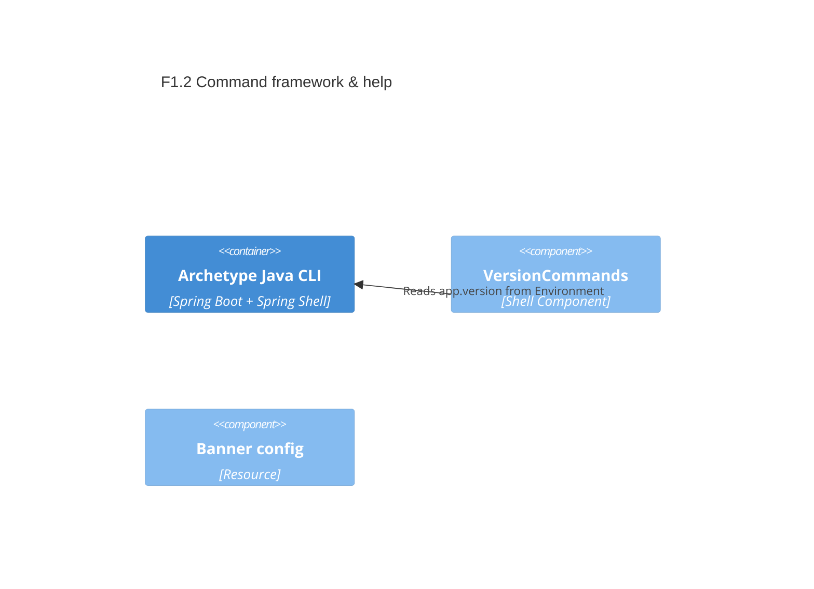

# F1.2 Command framework and help system Design 

## Overview

Provide the CLI’s foundational user interactions using Spring Shell: ensure interactive help is available, show an application banner, and expose a `version` command that prints build/version metadata. Keep command logic minimal and delegate any future behavior to services.

## Data Models

No persistent or complex data models are introduced. We use runtime metadata only.

### AppMetadata (runtime)

- Purpose: Output-only metadata displayed to the user
- Tier / Layer: Presentation

```
name: string        # spring.application.name
version: string     # app.version from properties or build info
```

## Components

### C1 VersionCommands

- Purpose: Provide a `version` command to print the application version
- Interfaces: `String version()` exposed via Spring Shell
- Dependencies: Spring Environment (to read `app.version`), optional BuildProperties if present later
- Reuses: Spring Shell annotations
  
```
public interface VersionCommandsApi {
  String version();
}
```

### C2 Banner configuration

- Purpose: Display a custom ASCII banner with application name on startup
- Interfaces: `banner.txt` resource interpreted by Spring Boot
- Dependencies: Spring Boot banner support
- Reuses: application.properties for app name

## User interface

### Command: version

- Purpose: Print semantic version for the running CLI
- Key: `version`

Behavior:
- Reads `app.version` property (default `dev`) and returns it as a single line

### Built-in: help

- Purpose: List available commands and show usage
- Provided by Spring Shell out of the box

## Aspects

### Monitoring

- INFO logs for startup include application name; version is visible via the `version` command

### Security

- No secrets; prints only non-sensitive metadata

### Error Handling

- If version is unavailable, fall back to `dev` from properties and return a clear value

## Architecture

Single-container CLI app. Commands live in a `cli.commands` package and call runtime configuration.

### Component Diagram



### File Structure

```plaintext
src/
  main/
    java/
      com/aiddbot/archetype/cli/commands/
        VersionCommands.java     # @ShellComponent exposing `version`
    resources/
      banner.txt                 # Custom ASCII banner
```

> End of Feature Design for F1.2, last updated 2025-08-28.
