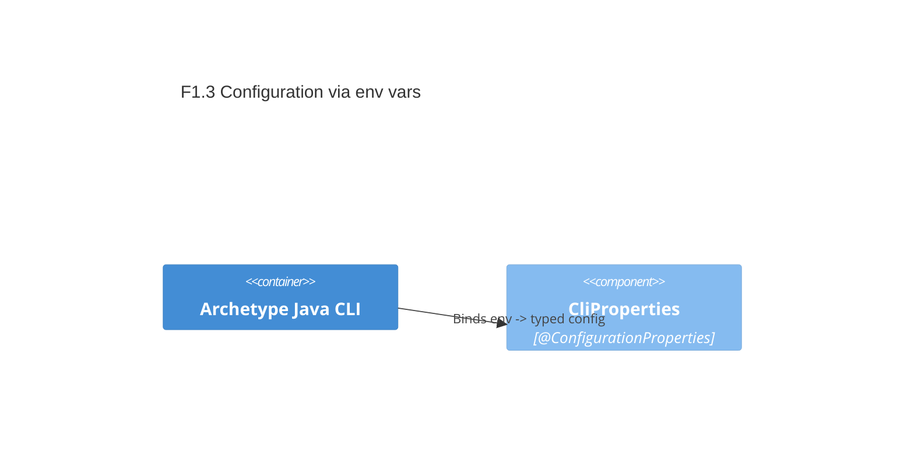

# F1.3 Configuration via environment variables Design 

## Overview

Introduce a typed configuration (`CliProperties`) to bind environment-driven settings: network timeouts and external endpoints. Provide sensible defaults and validation to fail fast on invalid input. This unlocks later networking features.

## Data Models

### CliProperties (configuration model)

- Purpose: Input configuration bound from properties/environment; no persistence
- Tier / Layer: Infrastructure / Configuration

```
cli:
  network:
    connect-timeout-ms: int >= 1 (default 2000)
    read-timeout-ms:    int >= 1 (default 2000)
  endpoints:
    ip-geo-base-url:        URI (default http://ip-api.com/json)
    open-meteo-base-url:    URI (default https://api.open-meteo.com/v1/forecast)
```

## Components

### C1 CliProperties (@ConfigurationProperties)

- Purpose: Provide typed access to CLI config with validation
- Interfaces: getters for network and endpoints, nested immutable types
- Dependencies: Spring Boot configuration processor; Jakarta Validation
- Reuses: Boot relaxed binding (ENV → kebab-case properties)

```
public class CliProperties {
  public static final class Network { int connectTimeoutMs; int readTimeoutMs; }
  public static final class Endpoints { URI ipGeoBaseUrl; URI openMeteoBaseUrl; }
}
```

### C2 Configuration bootstrap

- Purpose: Enable configuration properties scanning
- Interfaces: `@ConfigurationPropertiesScan` on application class
- Dependencies: Spring Boot auto-configuration

## User interface

No direct CLI command. Operators set environment variables or JVM/system properties.

## Aspects

### Monitoring

- Log resolved config at DEBUG only (not added now); rely on validation exceptions at startup.

### Security

- No secrets; only public URLs and numeric timeouts.

### Error Handling

- Use `@Validated` + constraints to fail fast on invalid values with clear messages.

## Architecture

Single-container; properties class is consumed by future HTTP client and feature code.

### Component Diagram



### File Structure

```plaintext
src/
  main/
    java/
      com/aiddbot/archetype/cli/config/
        CliProperties.java            # @ConfigurationProperties("cli")
    resources/
      application.properties          # defaults for cli.* keys
```

> End of Feature Design for F1.3, last updated 2025-08-28.
