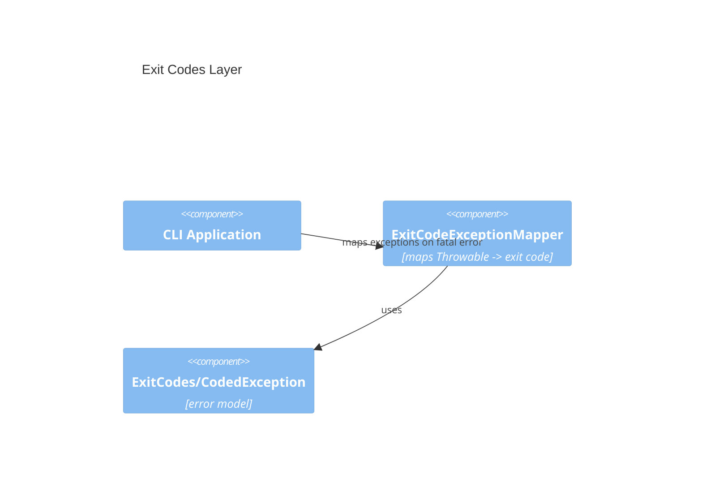

# F1.5 Exit codes and process lifecycle Design 

## Overview

Introduce a small error/exit-codes layer to the CLI to ensure deterministic process exit behavior. Provide:
- ExitCodes enum with stable values
- CodedException to raise domain-specific failures with explicit codes
- ExitCodeExceptionMapper that integrates with Spring Boot to map exceptions to codes and messages
- A try/catch in the main entrypoint to apply the mapped code when a fatal error occurs early in startup

This design keeps Spring Shell interactive behavior intact; exit codes are primarily for process termination scenarios (non-interactive mode or fatal startup failures).

## Data Models

### ExitCodes

- Purpose: Output enum representing process exit codes (Output)
- Tier / Layer: Presentation (CLI runtime)

```java
public enum ExitCodes {
  SUCCESS(0),
  VALIDATION(2),
  RUNTIME(3),
  IO(4),
  NETWORK(5),
  UNKNOWN(1);
  private final int code; /* getter */
}
```

### CodedException

- Purpose: Exception that carries an ExitCodes value (Error propagation)
- Tier / Layer: Presentation/Application boundary

```java
public final class CodedException extends RuntimeException {
  private final ExitCodes exitCode; /* getter */
}
```

## Components

### ExitCodeExceptionMapper

- Purpose: Map exceptions to ExitCodes for process termination
- Interfaces: `int map(Throwable t)`, `String message(Throwable t)`
- Dependencies: None (pure)
- Reuses: ExitCodes, CodedException

```java
public interface ExitCodeExceptionMapper {
  int map(Throwable t);
  String message(Throwable t);
}
```

### DefaultExitCodeExceptionMapper

- Purpose: Default mapping implementation
- Mapping rules:
  - CodedException → its code
  - IllegalArgumentException, ConstraintViolationException → VALIDATION(2)
  - IOException, UncheckedIOException → IO(4)
  - TimeoutException, SocketTimeoutException, ConnectException, UnknownHostException → NETWORK(5)
  - Other RuntimeException → RUNTIME(3)
  - Fallback → UNKNOWN(1)
- Dependencies: none

## User interface

### Process behavior

- Purpose: Ensure process exits with mapped code when a fatal exception bubbles to main
- Command: No new commands. Integrates at application boundary.

## Aspects

### Monitoring

- Log error with: category `exit`, fields: `code`, exception class, message.

### Security

- No additional concerns.

### Error Handling

- Centralize near application entry; commands may still throw CodedException.

## Architecture

- Pattern: Small utility layer, decoupled and testable. Avoids framework coupling in the mapper.

### Component Diagram



### File Structure

```
src/main/java/com/aiddbot/archetype/cli/runtime/
  ExitCodes.java
  CodedException.java
  ExitCodeExceptionMapper.java
  DefaultExitCodeExceptionMapper.java
```

> End of Feature Design for F1.5, last updated 2025-08-28.