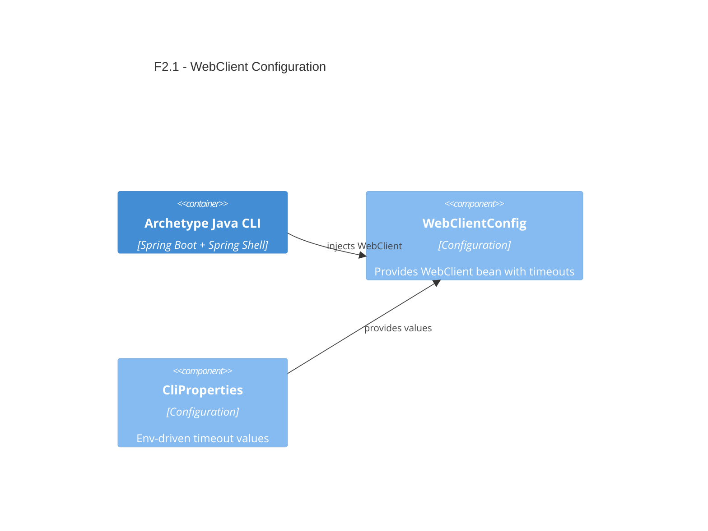

# F2.1 Reactive HTTP client with timeouts Design 

## Overview

Introduce a reusable, preconfigured reactive HTTP client using Spring WebClient to perform outbound HTTPS calls with sensible connect/read timeouts and JSON-friendly defaults. Configuration values are sourced from environment variables via `CliProperties`.

## Data Models

### Network (Config)

- Purpose: Input; holds connect/read timeout config in milliseconds.
- Tier / Layer: Presentation container, configuration layer.

```java
// Provided by existing code
class CliProperties.Network {
  int connectTimeoutMs; // default 2000
  int readTimeoutMs;    // default 2000
}
```

## Components

### WebClientConfig

- Purpose: Provide a singleton `WebClient` bean configured with timeouts, JSON defaults, and default headers.
- Interfaces:
  - `WebClient webClient(CliProperties props)` – Spring bean.
- Dependencies:
  - `CliProperties` for timeouts and, in future features, base endpoints.
  - Reactor Netty (`HttpClient`) for low-level timeouts.
- Reuses:
  - Existing Spring Boot auto-config, logging, and exception mapping.
  
```java
// Public API sketch (implementation planned in code step)
@Configuration
public class WebClientConfig {
  @Bean
  WebClient webClient(CliProperties props) { /* build and return */ }
}
```

Behavior details:
- Build a `ReactorClientHttpConnector` backed by `HttpClient`:
  - Connect timeout: `props.getNetwork().getConnectTimeoutMs()`
  - Read/response timeout: `props.getNetwork().getReadTimeoutMs()`
- Default headers:
  - `Accept: application/json`
  - `User-Agent: ArchetypeJavaCLI/<version>`; version via `Package#getImplementationVersion()` or fallback to `ArchetypeJavaCLI`.
- JSON codec: use Spring Boot’s default Jackson codecs; no custom mapper required.
- HTTPS: supported implicitly by WebClient; no extra work.

Notes on spec alignment:
- The spec mentions a single `apiTimeoutMs` and a default of 3000 ms with fallback on invalid values. The current config model exposes separate `connectTimeoutMs` and `readTimeoutMs` with `@Min(1)` and default 2000 ms. For the simplest, non-breaking design we will:
  - Use the existing separate properties and defaults (2000 ms each) to avoid breaking tests/config.
  - Fail fast on invalid values (per `@Min(1)`), consistent with existing validation behavior.
  - Optionally log the effective timeouts at startup for observability.
  - A future enhancement can add an aggregate `apiTimeoutMs` that, when set, applies to both.

## User interface

No direct CLI interface; this is an internal configuration. Commands and services will obtain the `WebClient` via dependency injection.

### Bean: webClient

- Purpose: Provide a preconfigured HTTP client for integrations (e.g., F3.x features).
- URL/Name: Spring Bean name `webClient`.

## Aspects

### Monitoring

- Log effective timeouts and default headers on application startup at INFO level.
- Timeouts and network errors will manifest as exceptions surfaced to the command layer; existing logging configuration will capture them.

### Security

- HTTPS by default when target URLs are HTTPS.
- No credentials handled; no PII in logs.

### Error Handling

- Connection or read timeouts throw reactive exceptions; commands should map them via existing `DefaultExitCodeExceptionMapper` (F1.5) to consistent exit codes and messages.
- We will not implement retries in this feature; callers may choose to add them case-by-case later.

## Architecture

The design fits the single-container CLI. The `WebClientConfig` lives in the configuration layer and is consumed by domain services or command handlers that perform HTTP calls.

### Component Diagram



### File Structure

```plaintext
src/
  main/
    java/
      com/aiddbot/archetype/cli/
        config/
          WebClientConfig.java   # Defines the WebClient bean with timeouts and headers
        // existing files
```

> End of Feature Design for F2.1, last updated 2025-08-28.
