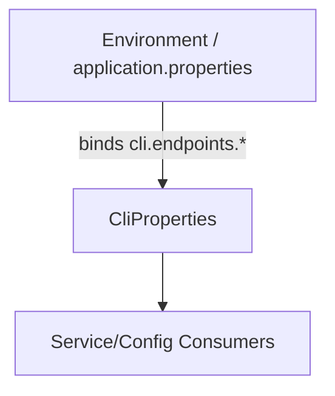

# F2.2 External endpoints configuration Design 

## Overview

Expose and validate environment-driven base URLs for two external services: IP Geolocation (ip-api) and Open‑Meteo. Values bind into `CliProperties.endpoints` as typed `URI` fields with defaults declared in `application.properties`. Other beans read from `CliProperties` to build requests.

## Data Models

### CliProperties.Endpoints

- **Purpose:** Input configuration (environment/properties) for external API base URLs
- **Tier / Layer:** Configuration layer (Spring Boot ConfigurationProperties)

```java
class CliProperties {
  static class Endpoints {
    URI ipGeoBaseUrl;      // default: http://ip-api.com/json
    URI openMeteoBaseUrl;  // default: https://api.open-meteo.com/v1/forecast
  }
}
```

## Components

### CliProperties (@ConfigurationProperties)

- **Purpose:** Bind and validate `cli.*` properties
- **Interfaces:** Getters `getEndpoints().getIpGeoBaseUrl()`, `getEndpoints().getOpenMeteoBaseUrl()`
- **Dependencies:** Jakarta Validation (`@NotNull`); Spring Boot binder
- **Reuses:** Existing `CliProperties` and defaults in `application.properties`
  
```java
public class CliProperties {
  public Endpoints getEndpoints();
  public static class Endpoints {
    public URI getIpGeoBaseUrl();
    public URI getOpenMeteoBaseUrl();
  }
}
```

### WebClientConfig (consumer)

- **Purpose:** Consumers construct HTTP requests using configured endpoints
- **Interfaces:** Uses `CliProperties` bean
- **Dependencies:** Spring WebFlux `WebClient`
- **Reuses:** Existing `WebClientConfig`

## User interface

N/A. Configuration-only feature; surfaced via environment variables/properties.

- Property keys:
  - `cli.endpoints.ip-geo-base-url`
  - `cli.endpoints.open-meteo-base-url`
- Environment variables (Spring relaxed binding):
  - `CLI_ENDPOINTS_IP_GEO_BASE_URL`
  - `CLI_ENDPOINTS_OPEN_METEO_BASE_URL`

## Aspects

### Monitoring

- Log resolved endpoints at INFO on startup in `WebClientConfig` when building clients.

### Security

- Endpoints are non-sensitive; no secrets stored. Prefer HTTPS for Open‑Meteo.

### Error Handling

- Invalid URIs trigger startup failure through bean validation (already covered by tests).

## Architecture

- Pattern: Externalized Configuration via Spring Boot `@ConfigurationProperties` + Jakarta Validation
- Simplicity: Store URIs only; downstream services assemble request paths/query params.

### Component Diagram



### File Structure

```plaintext
src/main/java/com/aiddbot/archetype/cli/config/CliProperties.java  # holds endpoints URIs
src/main/resources/application.properties                         # defaults
src/test/java/.../CliPropertiesTest.java                           # binding & validation
```

> End of Feature Design for F2.2, last updated 2025-08-28.
