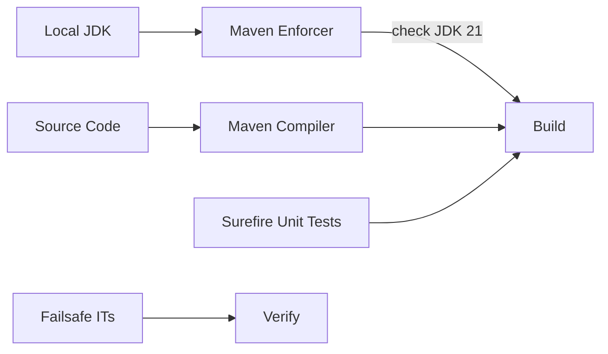

# F4.1 Maven build plugins configuration — Design 

## Overview

Introduce Maven plugins and configuration to enforce Java 21, structure tests, and keep resource handling predictable. Leverage Spring Boot parent for sensible defaults; add explicit plugins only where needed.

## Data Models

N/A (build system configuration).

## Components

### Maven Enforcer

- Purpose: Fail the build when Java version is not within [21,22).
- Interfaces: `maven-enforcer-plugin` with `requireJavaVersion`.
- Dependencies: Maven runtime.
- Reuses: Parent POM management for plugin resolution.

### Maven Compiler

- Purpose: Compile with release 21 to ensure consistent bytecode and JDK APIs.
- Interfaces: `maven-compiler-plugin` `<release>` property.
- Dependencies: JDK.

### Maven Toolchains (optional)

- Purpose: Use JDK 21 when toolchains are defined locally; avoid hard dependency when absent.
- Interfaces: `maven-toolchains-plugin` with activation on file existence.

### Surefire & Failsafe

- Purpose: Split unit vs integration tests; Surefire for unit tests; Failsafe for ITs in verify.
- Interfaces: `maven-surefire-plugin` and `maven-failsafe-plugin` includes/excludes; system properties set for Spring Shell off.

## User interface

N/A (build time behavior). Common invocations:
- `mvn -Dtest=*UnitTest test` (unit)
- `mvn -DfailIfNoTests=false -DskipITs=false verify` (enables Failsafe when skip flag is off)

## Aspects

### Monitoring

CI logs from Maven phases; no runtime.

### Security

No code execution changes; only build‑time enforcement.

### Error Handling

Build fails fast on wrong Java version or compilation issues; Failsafe handles post‑integration‑test failures.

## Architecture

Keep using Spring Boot parent for BOM and defaults; layer in plugins explicitly for clarity.

### Component Diagram



### File Structure

```plaintext
pom.xml           # Plugins: enforcer, compiler, surefire, failsafe, toolchains (profile)
```

> End of Feature Design for F4.1, last updated 2025-08-28.